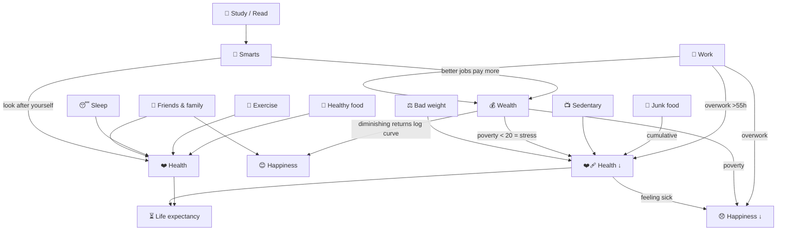
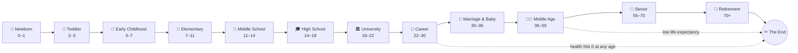

# Pixel Life Journey — Design & Balance Document

> A living design doc. The whole game is **data-driven**: the life-stage graph
> below mirrors the data in [`src/stages.ts`](src/stages.ts). To add or change a
> stage of life, edit a node here **and** the matching `Stage` object — they are
> meant to stay in sync.

---

## 1. Concept

You live one whole pixel life, left to right, one room per stage. In each room you
walk up/down/left/right between **option stations** and press a button to do them.
Every choice nudges your five life **indices** and ages you a little. When you are
old enough, the door on the right opens and you "grow up" into the next room.

Balance is the whole game: chase money too hard and your health, fun and happiness
suffer; ignore your health and your life is cut short. At the very end, the game
writes the **story of the life you lived**, with comments explaining why each habit
mattered.

---

## 2. The indices (0–100 meters)

| Index | Icon | What raises it | What lowers it |
|-------|------|----------------|----------------|
| **Health** | ❤️ | healthy food, exercise, sleep, check-ups, social ties | junk food, overwork, sedentary time, ageing, bad weight |
| **Happiness** | 😊 | family, friends, love, fun, hobbies, *some* wealth | poor health, poverty, overwork, loneliness |
| **Wealth** | 💰 | work, jobs, investing (scaled by Smarts & occupation) | spending on fun, travel, partying, a home |
| **Fun** | 🎉 | play, toys, games, music, hobbies, parties, travel | doing nothing but work/study |
| **Smarts** | 🧠 | study, reading, music, internships, upskilling | too much screen time, never learning |
| **Weight** | ⚖️ | junk food, sweets, sedentary time | healthy food, exercise & sports |

**Weight** is special: ~50 is ideal, and the bar is colour-coded (green healthy,
amber over/under, red obese). It isn't "more is better" — drifting outside the
healthy band (40–64) quietly **drains health** every action, so it feeds longevity.

Plus two derived values:

- **Age** — advances with every action and slowly over time. Crossing a stage's
  end-age opens the door.
- **Life expectancy** — computed from your *average health across life*. Shown in
  the HUD as `~78y`. If your age reaches it, your life ends.

---

## 2b. Core mechanics

- **👦/👧 Gender** — chosen at birth. Changes the character sprite (hair, palette)
  and the story's pronoun ("a baby boy/girl was born").
- **🧸 Toys** — car, doll and (later) smartphone appear as choices in the young
  rooms; each is a different Fun / Smarts / social trade-off (the phone costs
  Health & Smarts).
- **⚖️ Weight** — see above; junk piles it on, exercise burns it off, balance keeps
  you healthy. Tuned so 1 junk ≈ 1 exercise cancels out.
- **💼 Occupation → salary** — at the Career stage you pick a job
  (see [`occupations.ts`](src/occupations.ts)). Your salary = `base × (0.7 +
  Smarts/140) × the job's pay multiplier`, so **Smarts and the job together** set
  your pay. Better jobs are **locked** until you're smart enough (Doctor needs 🧠 68),
  and you can **upskill** at work to raise Smarts mid-career.
- **🏠 Buy a house** — at Career/Marriage you can buy a home you can afford
  (see [`houses.ts`](src/houses.ts)). The tier sets a lasting **home quality (1–4)**
  that becomes the *background* of every home room afterwards — a grand house is
  bright and decorated; a cheap flat is **cracked and run-down**. Upgrades only.
- **⏳ Time-travel pill** — a HUD button (or the `T` key) opens a list of every age
  you've lived; pick one to **rewind** there and re-live from that point. The
  rewound state is restored exactly (stats, weight, age, partner, job, home), and
  anything you hadn't acquired yet is cleared.

---

## 2c. People & relationships

Every room is populated with the **people in your life at that stage**, drawn as
little characters you walk up to and bond with (an option with a `person` field —
see [`stages.ts`](src/stages.ts)):

| Stage | People you can bond with |
|-------|--------------------------|
| Newborn / Toddler / Early | 👩 Mum, 👨 Dad, 👵 Grandma, 👴 Grandpa, playmates, siblings |
| School (elementary→high) | study pals, best friends, and a 💞 first crush |
| University | roommate, a campus romance |
| Career | 🧑‍💼 coworker, 🏃 gym buddy |
| Marriage → Retirement | 💑 spouse, 🧒 your children, 👶 grandkids, old friends |

Bonding raises **happiness** and **health** (social connection is one of the biggest
longevity factors), and some bonds also nudge **smarts** (study pal) or burn **weight**
(gym buddy). People appear only in context: the spouse shows once you're married, your
kids only after you have them.

### Spouse mortality (by gender)

Marry as a **woman** and your (older) **husband passes away earlier** — around age 70 —
because men tend to die younger; marry as a **man** and your wife outlives you. The loss
is a real beat: a grief hit to happiness and health, the spouse leaves the room, and your
life story records it.

---

## 2d. Twists of fate & special items

**🎲 Random events** ([`events.ts`](src/events.ts)) — every so often (roughly 1 in 6
actions, after a short cooldown) life throws a surprise that pops up, applies its effect,
and gets woven into your life story:

- 👛 **Found a wallet** → a $100,000 reward
- 🎟️ **Lottery jackpot** → $500,000 (once per life, rare)
- 📜 **Inheritance** from family → $250,000 (once)
- 🎉 surprise bonus, 🐶 a stray puppy, 🌟 going viral, 🤝 a repaid loan, 🏆 a contest win,
  🎓 a scholarship, 🎁 a free gym year…
- …and the occasional setback to keep luck honest: ⚠️ a scam, 🏥 a medical bill, 💥 a
  cracked phone.

Events are age-gated (no lottery for a toddler) and weighted by rarity. To add one, drop
an entry in `EVENTS`.

**📗 The good-habits book** (a `habit`-flagged option in many stages) — a special item with
a *cumulative* payoff. Each read gives a little smarts and happiness, but read it **5+
times across your life** and the habit sticks: a one-time **+15 ❤️** at the 5th read, then
**+4 ❤️** every read after. Good habits compound — just like in real life.

---

## 3. Balance model (grounded in real research)

These relationships are deliberately modelled on published findings, so "playing
well" rewards the same habits that help in real life. Sources are listed in §7.

**Key modelled rules:**

1. **Money → happiness has diminishing returns.** Happiness rises with the *log* of
   wealth — being broke hurts a lot, extra riches help less and less. Implemented in
   `wealthHappinessBias()`. *(Kahneman & Killingsworth, 2023.)*
2. **Health is the foundation of longevity.** Life expectancy ≈ `50 + 0.4 × average
   health`, because lifestyle accounts for ~90% of longevity, with diet, exercise,
   **sleep** and social connection as the biggest levers. Implemented in
   `lifeExpectancyFromHealth()`. *(Harvard Nutrition Source; longevity-habits study.)*
3. **Overwork backfires.** The "Overtime grind" options give the most money but cut
   health, fun *and* happiness — long hours (>55h/week) are linked to worse health
   and lower life satisfaction. *(WHO/ILO long-working-hours review; Cleveland Clinic.)*
4. **Smarts open doors.** Options flagged `scalesWithSmarts` pay more the smarter you
   are, and finishing university grants a one-time salary bonus of `0.2 × Smarts`.
5. **Neglect compounds.** A small passive drain each action (worse with age) means you
   must keep actively investing in health, fun and learning or they slide.
6. **The meters pull on each other** (`crossEffects()` in [`stats.ts`](src/stats.ts),
   applied every action): **poverty** (wealth < 20) is stressful — it drains health and
   happiness; **poor health** drags your mood down the sicker you get; **a joyless life**
   (low fun) erodes happiness; **being smart** helps you look after yourself (a small
   protective health effect); and being **very over- or under-weight** is dispiriting.
   So no stat lives in a vacuum.

---

## 4. The life-stage graph

> **Extending the journey:** add a new `Stage` to `STAGES` in `src/stages.ts` (with
> `ageStart`/`ageEnd` continuous with its neighbours) and drop a node into the graph
> above. No engine changes are needed — rooms, stations and progression are generated
> from the data.

---

## 5. Per-stage options

Effects are the immediate deltas; a small passive drain also applies each action.

### 👶 Newborn (0–1)
| Option | Effects | Note |
|--------|---------|------|
| 🍼 Milk | +8 ❤️ +4 😊 | a strong, healthy start |
| 😴 Nap | +7 ❤️ +2 🎉 | babies grow in their sleep |
| 🤱 Cuddle | +8 😊 +3 ❤️ | love makes a secure baby |
| 🗣️ Babble | +6 🧠 +2 😊 | first words forming |
| 🪀 Rattle | +8 🎉 +2 😊 | pure baby joy |

### 🧒 Toddler (2–3)
🍓 Fruit `+8❤️` · 🍬 Candy `+8🎉 −6❤️` · 🧱 Blocks `+7🧠 +3🎉` · 📺 Cartoons `+7🎉 −2🧠` · 🛝 Playground `+5❤️ +5🎉` · 🤗 Family hug `+7😊 +2❤️`

### 🧒 Early Childhood (3–7)
📚 Story books `+8🧠` · 🥦 Veggies `+8❤️` · 🍭 Sweets `+7🎉 −6❤️` · 🚲 Ride bike `+6❤️ +4🎉` · 🎵 Music `+6😊 +4🎉` · 🎮 Video games `+8🎉 −3❤️` · 👫 Playdates `+6😊 +2❤️`

### 🎒 Elementary (7–11)
📖 Study `+9🧠 −2🎉` · ⚽ Sports `+8❤️ +3🎉` · 🎮 Games `+8🎉 −3❤️ −2🧠` · 🎹 Music class `+4🧠 +5😊` · 🥗 Healthy lunch `+7❤️` · 🍔 Fast food `+6🎉 −6❤️` · 🧑‍🤝‍🧑 Friends `+7😊 +2❤️`

### 📐 Middle School (11–14)
📚 Study hard `+9🧠 −3🎉` · 🏀 Sports `+8❤️ +3😊` · 🎮 All-night gaming `+9🎉 −5❤️` · 🎸 Band `+6😊 +4🎉` · 📖 Read `+7🧠` · 😴 Good sleep `+7❤️ +2🧠` · 🥤 Snacks & soda `+6🎉 −6❤️`

### 🎓 High School (14–18)
📝 Study exams `+10🧠 −3🎉 −2😊` · 🎉 Party `+9🎉 +4😊 −4❤️ −4💰` · 🏈 Sports `+8❤️ +2😊` · 💵 Part-time job `+8💰 −3🎉` *(×Smarts)* · 💞 First love `+9😊 −2🧠` · 🥗 Eat healthy `+7❤️` · 🍟 Fast food `+6🎉 −6❤️`

### 🏛️ University (18–22)
🎓 Study `+10🧠 −2🎉` · 💼 Internship `+7💰 +4🧠 −3🎉` *(×Smarts)* · 🍻 Parties `+9🎉 −5❤️ −4💰` · 🏋️ Gym `+9❤️ +2😊` · 🧑‍🤝‍🧑 Clubs `+7😊 +3🎉` · 🌍 Travel `+8🎉 +5😊 −6💰` · 🍜 Instant noodles `+3🎉 −5❤️ +2💰`

### 💼 Career (22–30)
⏰ Overtime grind `+12💰 −7❤️ −6🎉 −4😊` *(×Smarts)* · 💼 Steady work `+8💰 −2🎉` *(×Smarts)* · 💻 Side hustle `+7💰 +2🧠 −3🎉` *(×Smarts)* · 🏋️ Gym `+9❤️` · 🏖️ Vacation `+9🎉 +6😊 −6💰` · 🍷 Friends & dates `+7😊 +3🎉 −2💰` · 🍔 Desk fast food `+3🎉 −6❤️`

### 💍 Marriage & Baby (30–36) — *first pick a partner!*
👶 Have a baby `+12😊 −6💰 −4🎉 −2❤️` *(once)* · 🏡 Family time `+8😊 +3❤️` · 🌹 Date nights `+6😊 +5🎉 −3💰` · 💼 Work for family `+9💰 −3🎉` *(×Smarts)* · 🥗 Family meals `+8❤️ +2😊` · 🏠 Buy a home `+7😊 −10💰` *(once)* · 🚴 Stay active `+8❤️ +2🎉`

### 🧑‍🦳 Middle Age (36–55)
⏰ Career peak `+11💰 −6❤️ −4🎉` *(×Smarts)* · 🏃 Exercise `+10❤️` · 🎨 Hobbies `+8🎉 +4😊` · 🩺 Health checkup `+8❤️ +1😊` · 📈 Invest `+8💰 −1🎉` *(×Smarts)* · 🍩 Stress eating `+4🎉 −7❤️ −2😊` · ✈️ Family travel `+8🎉 +6😊 −6💰` · 🤝 Mentor `+6😊 +4🧠`

### 👴 Senior (55–70)
🚶 Daily walks `+8❤️ +3😊` · 👵 Grandkids `+9😊 +2❤️` · 🎣 Hobbies `+8🎉 +3😊` · 🥗 Healthy diet `+8❤️` · 🩺 Doctor visits `+8❤️` · 📺 TV all day `+5🎉 −5❤️` · 👫 Community `+8😊 +3❤️`

### 🌅 Retirement (70+)
✈️ See the world `+9🎉 +6😊 −6💰` · 🌱 Gardening `+7❤️ +4😊` · 👨‍👩‍👧 Family `+9😊 +2❤️` · 🛋️ Rest `+5❤️ +2🎉` · 🤲 Volunteer `+7😊 +3🧠` · 📓 Reflect `+6😊 +2🧠`

---

## 6. Partners, story & endings

- **Partners** (`src/partners.ts`): eight archetypes. The one you marry applies a
  small passive modifier *every chapter afterwards*, so an early, well-chosen marriage
  compounds. e.g. Maya the Doctor `+3❤️`, Leo the Entrepreneur `+4💰 −1🎉`.
- **Story** (`src/story.ts`): each option carries a `storyTag`; at the end the game
  groups your choices into life eras and writes a paragraph per era using a bank of
  pre-written "why it mattered" comments (milk → *"a strong, healthy start"*). Add a
  behaviour by giving its option a `storyTag` and an entry in `TAG_CLAUSES`/`TAG_NOTE`.
- **Endings**: *A Life Cut Short* (health reached 0 / very low life expectancy) or a
  peaceful end whose title and epitaph reflect your strongest meters.

---

## 7. Research sources

- Kahneman & Killingsworth (2023), *Income and emotional well-being: a conflict
  resolved*, PNAS — happiness rises with the **log** of income (diminishing returns).
- Harvard T.H. Chan *Nutrition Source — Healthy Longevity*; "8 habits add up to 24
  years" longevity study — diet, exercise, **sleep**, social connection drive lifespan.
- WHO/ILO and Cleveland Clinic reviews on **long working hours** — >55h/week raises
  health risks and lowers wellbeing and life satisfaction.

(Full links are in the project README and the build conversation.)

---

## 8. Controls

- **Move:** Arrow keys / WASD (up, down, left, right)
- **Choose:** Space / Enter / E on a highlighted station
- **Grow up:** walk into the glowing door on the right once you're old enough
- **Touch:** on-screen D-pad + ✓ button (shown on phones)
